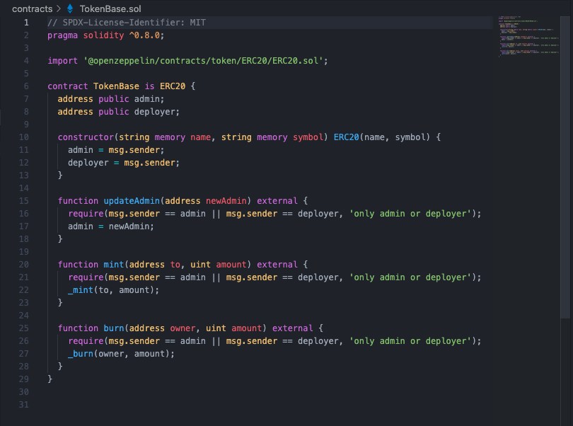
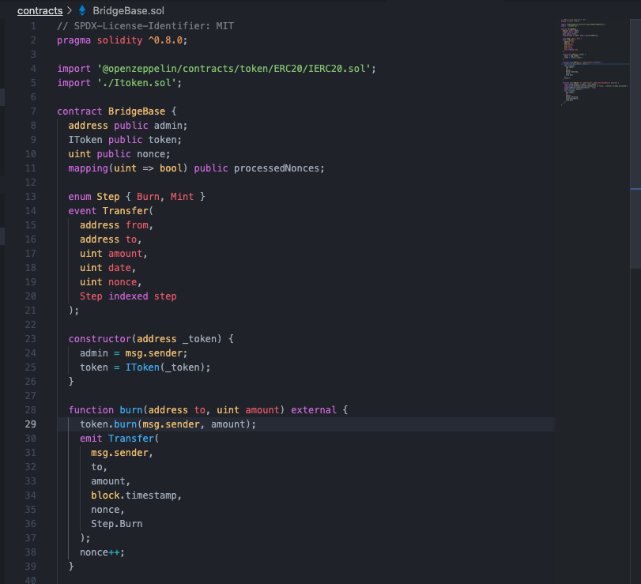
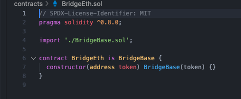
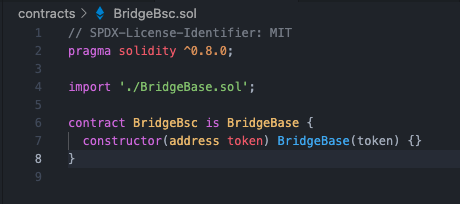
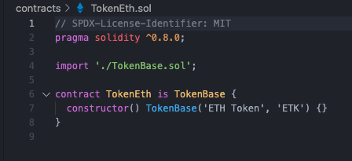
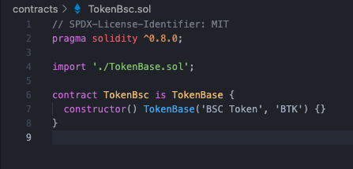
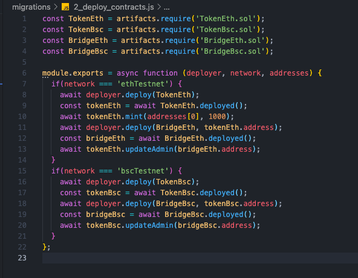
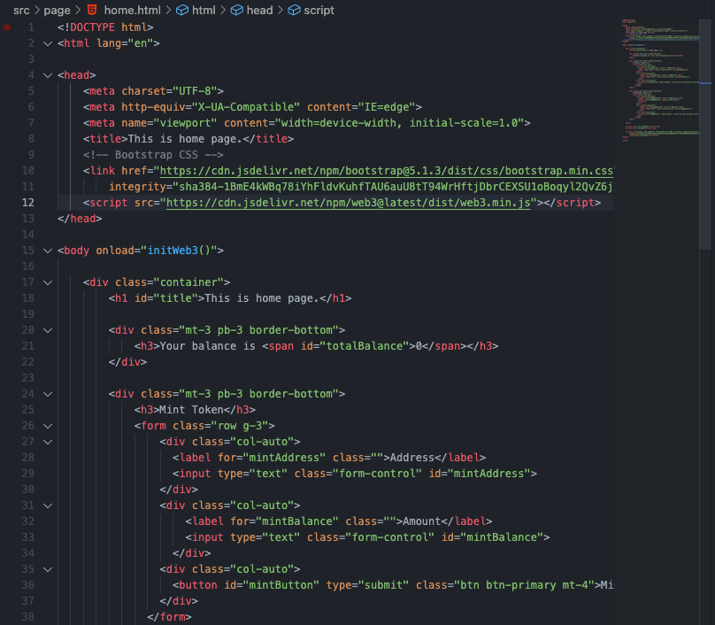

# ETH BSC Bridge


# Structure 


โครงสร้างสำคัญของโปรเจคจะ แบ่งเป็น 3 ส่วนได้แก่ 
 - Bridge Contract ใช้สำหรับ burn token เมื่อเราต้องการที่จะส่ง token ข้าม chain token จะถูกเก็บไว้ที่ address 0 และจะทำการ mint token (Contract Bridge อีกฝั่งหนึ่ง) ไปที่ address เดี่ยวกันกับที่ส่ง transaction เข้ามา
 - Token Contract เป็น asset ที่ใช้ในการส่งผ่าน transaction  
 - Bridge API เป็น Trigger ดักจับ event ที่เราต้องการในกรณีนี้ event ที่เราต้องการดังจับคือ "Transfer" เมื่อดักจับได้ก็จะนำค่าที่อยู่ใน event มาใช้งานในการ mint token ให้ address เท่ากับจำนวนที่ได้ทำการ brun ไป

## Init Project Truffle 

ให้เราทำการติดตั้ง Truffle ตรวจสอบว่าติดตั้งเสร็จเเล้วผ่านคำสั่ง 

```
npm install -g truffle

truffle -v
```

หลังจากนั้นให้ทำการ init project npm และ truffle 

```
npm init -y

truffle init 
```

หลังจาก run คำสั่งเเล้วตัว truffle จะทำการสร้าง folder ให้ 3 folder 

- folder  contracts ใช้สำหรับเขียนไฟล์ solidity 

- folder migrations ใช้สำหรับเขียน script เพื่อ deploy ขึ้น blockchain 

- folder test ใช้สำหรับเขียน test สำหรับ smart contract 

*** สำคัญมาก ตัว smart contract deploy ไปเเล้วไม่สามารถเเก้ไข้ได้ ทำได้เเค่การ deploy contract อันใหม่ขึ้นไปเเทนเท่านั้น 

## Install Dependencies ที่ต้องใช้ใน Project 

```
npm install @openzeppelin/contracts chai chai-as-promised express web3
```

- @openzeppelin/contracts ใช้สำหรับคุณสมบัติของ class ที่เขียนตามมาตรฐาน ERC20 เเละ ERC721 ที่ทาง openzeppelin ได้เขียนไว้มาใช้ 
- chai เเละ chai-as-promised ใช้สำหรับเขียน test ของ smart contract 
- express ใช้สำหรับสร้าง server 
- web3 ใช้สำหรับเชื่อต่อกับ Blockchain Infrastructure ที่รัน Node ของ Ethereum อยู่ และเปิดให้เราสามารถเข้าไปเรียกใช้ APIs ต่างๆ ได้ 

จากนั้นให้ทำการสร้าง file solidity ทั้งหมด 8 file 

## อธิบาย  Code Smart Contract

## TokenBase.sol 



TokenBase เป็น base class ที่จะใช้สร้าง Token ที่ใช้ในการทำเหรียญ 
มี State variable 2 ตัวได้เเก่ 
admin เป็นประเภท address มีหน้าที่ในการบอกว่าใครเป็น admin ของ contract นี้
deployer เป็นประเภท address มีหน้าที่ในการบอกว่าใครเป็นผู้ deploy contract 

function constructor จะทำการกำหนดค่าให้ตัวเเปล admin และ deployer ให้มีค่าเท่า address ของผู้สร้าง transaction (msg.sender) 

contract TokenBase จะประกอบไปด้วย 3 function หลักได้แก่

 - function udateAdmin 

 - function mint 

 - function burn 

โดยแต่ละ function จะอนุญาติให้ผู้เรียกใช้เป็น admin หรือ deployer เท่านั้น 

## BridgeBase.sol



Contract BridgeBase ป็น base class ที่จะใช้สร้าง Bridge Contract 
ประกอบไปด้วย State variable 5 ตัวได้เเก่ 

 - admin เป็นประเภท address 
 - token เป็นประเภท Itoken ซึ้งมาจากอีก contract ใช้ในการ interract กับ contract ของ token 
 - nonce เป็นประเภท uint ใช้เพื่อเป็นตัว tracking ว่า transaction ถูกส่งมานั้นเป็นลำดับที่เท่าไหร่ 
 - processedNonces เป็นประเภท mapping ของ nonce เเต่ละ transaction ว่าถูกดำเนินการไปเเล้วหรือไม่ เช่น nonce ลำดับที่ 1 มีค่าเป็น false เป็นต้น
 - Step เป็นชนืด enum ที่มีค่าเป็น Burn และ Mint ใช้บอกสถานะของ transaction นั้นๆ 

 event Transfer เป็นสิ่งที่เราจะทำการ emit มันเมื่อมี transaction ที่เราต้องการเกิดขึ้น ซึ้งเราจะสามารถอ่านค่าของ event ได้จาก res ของ transaction นั้นๆ 

 function constructor ทำหน้ามราสำคัญสองอย่างคือ 
  - กำหนดค่าให้ตัวแปล admin ให้เท่ากับ address ของผู้ส่ง transaction 
  - กำหนดค่าให้ตัวแปล token* ทำให้เราสามารถสือสารกับ contract Token ผ่าน contract Bridge ได้ เช่น ทำการ mint token ผ่าน contract Bridge ได้เลยเป็นต้น (เมื่อเราทำการ deploy contract Bridge และ Token เราจำทำการเปลี่ยน address admin ของ contract Token ให้เป็น address ของ contract Bridge เพื่อให้สามารถเรียกใช้งาน function ได้ )

  

contract Bridge มี function หลักอยู่ 2 function ได้แก่ 

 - function burn จะทำการเรียกใช้งาน function burn ของ contract Token หลังจากนั้นจะ emit event Transfer เพื่อให้ listener ที่เราได้ทำการวางไว้ดัก event ที่เกิดขึ้นและทำการ mint Token ไปยังอีก chain หนึ่งได้ function นี้จะไม่ทำการ require ให้เฉพาะ admin เรียกใช้ได้เพราะเราต้องการที่จะให้ทุกๆ address นั้นทำการ bridge token ได้

 - function mint จะถูกเรียกใช้เมื่อตัว listener ทำการดักจับ event Transfer ได้ จากนั้นจะทำการ เช็ค mapping ของ nonce ที่ transaction นั้นเป็น false หรือไม่ถ้าเป็นเเสดงว่า transaactions นั้นถูกนำเนินการไปเเล้ว หลังจากนั้นจะ set mapping nonce เป็น true และทำการ mint token ให้ address และทำการ emit event  transfer 


## IToken.sol


contract IToken เป็น interface ที่นำมาใช้ใน contract Bridge เพื่อให้สามารถ interract กับ contract token ได้มี 2 function ได้แก่

 - mint 

 - burn 

 ## BridgeBsc.sol และ BridgeEth.sol 

 

 

 ทั้งสอง contract นั้นสืบทอดมาจาก contract BridgeBase เพื่อให้ทั้งสอง contract มี function และ State variable ที่มีอยู่ใน BridgeBase 

 ## TokenEth.sol และ TokenBsc.sol





ทั้งสอง contract นั้นสืบทอดมาจาก contract TokenBase เพื่อให้ทั้งสอง contract มี function และ State variable ที่มีอยู่ใน TokenBase 

## Deploy Contract 

หลักจากสร้าง contract ครบเเล้วให้เราทำการไปที่ floder migrations เพื่อสร้าง script สำหรับ deploy contract ของเราไปที่ blockchain 

สร้าง file 2_deploy_contracts.js ขึ้นใน floder migrations



บรรทัดที่ 1 - 4 คือการ import file solidity เข้ามาเพื่อใช้ deploy 

 - ในการ deploy smart contract ของ project นี้เราจะทำการ deploy ทั้งหมด 2 ครั้งเนื่องจากเราจะทำการ bridge ข้าม chain จาก ETH ไปที่ BSC โดยเราจะเช็คว่า deploy ไปที่ network ไหนผ่านตัวแปล "network" 

 - โดยในการ deploy ไปที่ ethTestnet จะทำการ mint token ไปที่ address ของผู้ deployed contract และ เรียก function updateAdmin ให้เป็น address ของ contract Bridge ด้วย ไม่เหมือนกับฝั่ง bscTestnet ที่มีการเรียกใช้ updateAdmin เพียงอย่างเดี่ยว 

 ทำการ deploy contract ผ่านคำสั่ง 

 ```
truffle migrate --reset --network ethTestnet

truffle migrate --reset --network bscTestnet
 ```

 หลังจาก run คำสั่งแล้ว truffle จะทำการ compile solidity ออกมาเป็น ABI ที่อยู่ในรูปแบบ json เพื่อใช้ในการ connect กับ smart contract ที่่เราได้ทำการ deploy ขึ้นไป 

 ## เตรียมการฝั่ง Server 

 

สร้าง folder src ขึ้นมาเพื่อเก็บ code ฝั่ง server 

```
mkdir src 

cd src 

mkdir page & mkdir static 

cd static 

mkdir js 
```
สร้าง file index.js ใน floder src เพื่อเป็น server สำหรับส่ง file ไปที่ฝั่ง user 


ในฝั่งของ user จะมีไฟล์สำคัญอยู่ทั้งหมด 3 file ได้แก่ 

 - home.html 
 - home.js ใช้สำหรับเรียกใช้ function ของ contract ที่เราได้ทำการ deploy ไป 
 - initWeb3.js ใช้สำหรับเชื่อต่อกับ blockchain 

สร้าง home.html สำหรับ user ใน floder page 

function หลักของเว็ปนี้จะสามารถ mint token ให้กับ address ที่ระบุได้ และ bridge token ไปยังอีก chain ได้ 




บรรทัดที่ 10 import bootstrap css เข้ามาในหน้าเว็ป 

บรรทัดที่ 12 import web3.js มาใช้ที่ฝั่งหน้าบ้าน 

บรรทัดที่ 61 import initWeb3.js ใช้สำหรับเชื่อต่อกับ blockchain 

บรรทัดที่ 62 import home.js ใช้สำหรับเรียกใช้ function ของ contract ที่เราได้ทำการ deploy ไป 

บรรทัดที่ 64 import bootstrap js เข้ามาในหน้าเว็ป 

## initWeb3.js 

สร้างไฟล์ initWeb3.js ขึ้นมาใน src > statis > js 

ไฟล์ initWeb3.js จะประกอบไปด้วย 3 function หลักได้แก่ 

 - function onGetAbi ทำหน้าที่ในการดึง file abi ของแต่ละ contract ที่เราต้องการจากฝั่ง server 

 - function loadWeb3 ทำหน้าที่สำหรับเช็คว่า browser ที่ user ใช้อยู่นั้นมี wallet ติดตั้วอยู่หรือไม่ (meta mask)

 - function loadBlockchainData ทำหน้าที่ในการตรวจสอบ network ที่ user ได้ทำการเชื่อมต่ออยู่กับ browser ว่าอยู่ใน network ที่เราต้องการจะเชื่อมต่อหรือไม่ (RopstenTestnet, bscTestnet) หากใช้ก็จะทำการเรียกใช้ function connectToBlockchain เพื่อเชื่อต่อเข้ากับ network นั้นๆ 

 - function connectToBlockchain ทำหน้าที่ในการนำ abi และ network id มาเพื่อ connect กับ blockchain 